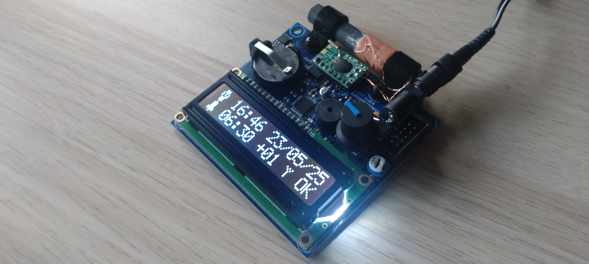

# dcf77-clock-pcb

**DCF77-controlled** radio clock PCB based on the **ATmega88** microcontroller, **MAS6181B** AM receiver, and **DS1307** RTC.

**Capabilities:**
* Time and date display
* Alarm handling
* Manual date and time setting
* Automatic periodic synchronization with the DCF77 signal
* Time synchronization status display
* Time zone configuration
* DCF77 signal parameters preview during synchronization
* Time and date retention via CR2032 battery
  
**Hardware:**
* ATmega88
* MAS6181B DCF77 receiver
* DS1307 RTC + CR2032
* 2x16 HD44760 LCD
* Rotary Encoder + LED + Buzzer

**Firmware:**
* C11
* Custom MCU peripheral and external circuit drivers

## Tools
* Autodesk EAGLE v9.6.2

## External links
* Firmware repository: https://github.com/mlokcewicz/dcf77-clock
