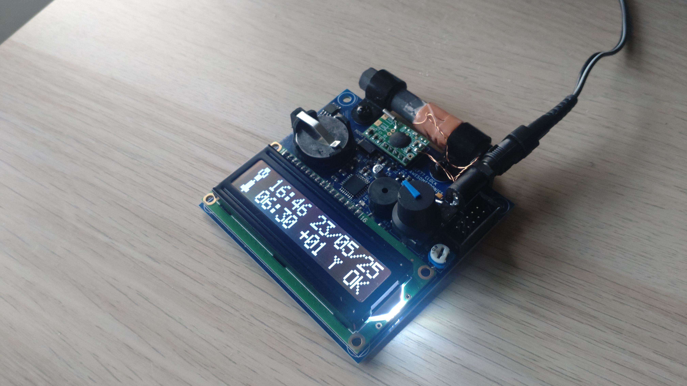

# dcf77-clock-pcb

DCF77 controlled radio clock PCB based on ATmega88 microcontroller, MAS6181B AM receiver, DS1307 RTC. 

Capabilities:
* Time and date display
* Alarm handling 
* Automatic and manual remote time and date synchronization to DCF77 signal
* Time synchronization status display
* Time zone configuration
* DCF77 signal parameters preview during synchronization
* Time and date retention by CR2032 battery
 

Hardware:
* ATmega88
* MAS6181B DCF77 receiver
* DS1307 RTC + CR2032
* 2x16 HD44760 LCD
* Rotary Encoder + LED + Buzzer

Software:
* C
* Own MCU peripherals and external circuits drivers

## Tools
* Autodesk EAGLE v9.6.2

## External links
* Firmware repository: https://github.com/mlokcewicz/dcf77-clock
